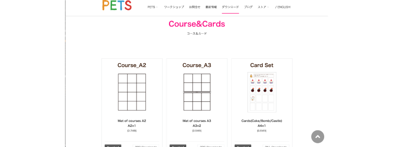
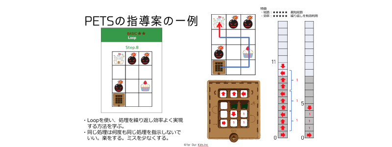

[PETS](https://4ok.jp/pets/)
---

---
# PETSって何？

## 論理的思考力を鍛える
PCもインターネットも使わないで
プログラミングして動かすロボットです。

---
# PETSが生まれた背景

エンジニアのコミュニティから自分の子供に教えるのに最適な教材はないか探した時に
最初に触らせるのに最適な教材が無かった。

## 無いなら作ろう！
---
# for Our Kids

## For My Kidsから for Our Kidsへ

### 楽しい！が大事「興味があれば勝手に学ぶ！」
---
## 失敗を恐れずに、何度でも挑戦させたい！

---
## とにかく試行錯誤「頭を使わせたい」

---

# PETS 特徴
- スモールステップで教えないで学べるカリキュラム
- 見方を変えないと解けない課題で思考の幅を広げる
- 先生が教えたいをすぐに実現できるように

---

# PETS 「オープンソース」

[https://4ok.jp/pets/dl/](https://4ok.jp/pets/dl/)

---

# 実績

公立
- 第３学年　算数　「プログラミングで算数」　杉並区立天沼小学校
- 第２学年　国語　「きせつのことば④　冬がいっぱい」　杉並区立天沼小学校
- 第２学年　生活科「作って試して（プログラミングってなぁに）」東玉川小学校
- 第１学年　算数「ばしょをあらわそう」いぶき野小学校
- 第１学年　総合「プログラミング授業公開」前原小学校
- 第１学年　道徳「主として集団や社会との関わりに関すること」七里小学校
- 第３学年　公開授業「PETSでプログラミング体験」十日市場小学校
- 第3－6学年　パソコン倶楽部　「PETSでプログラミング体験　鮫沢小学校
- 第２学年　総合　「順次処理の理解」品川区立京陽小学校
- 特別支援学級　生活　「プログラミングの授業」町田市立南つくし野小学校

私立
- 第１学年～第６学年（全校生徒）総合「プログラミング体験」函嶺白百合学園小学校

---

＃指導案

