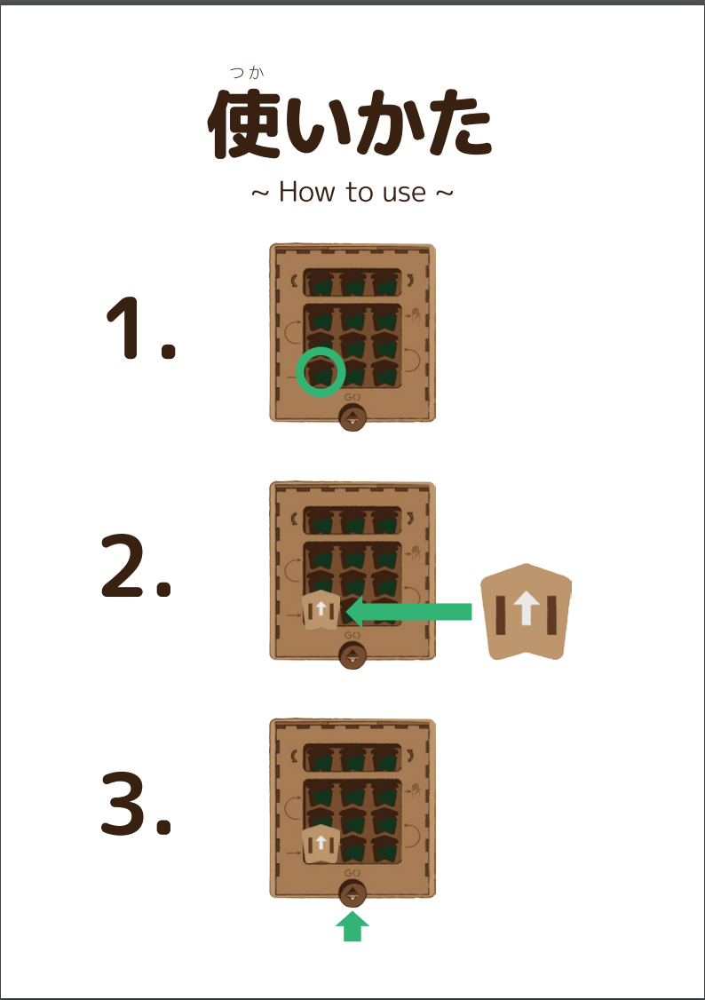

---

---
# PETSって何？

## 論理的思考力を鍛える
PCもインターネットも使わないで
プログラミングして動かすロボットです。

---
## PETSが生まれた背景

エンジニアのコミュニティから自分の子供に教えるのに最適な教材はないか探した時に
最初に触らせるのに最適な教材が無かった。

### 無いなら作ろう！
---
### co-Founder

---
### co-Founderの関係団体
- [一般社団法人 Tokyo Motion Control Network](http://tokyomotioncontrol.net/)
- [株式会社 The Designium](http://www.thedesignium.com/)
- [株式会社 HOLO LAB](http://hololab.co.jp/)
- [NPO法人 WRO Japan](https://www.wroj.org/2017/)
- [合同会社 ワタナベ技研](http://watanabegiken.tokyo/)
- [合同会社 The Waggle](https://thewaggle.co.jp/)
---
### 教育と学習の違い
- 教育　教育者が主役 |
- 学習　学習者が主役 |

---
### 教育者が主役とは？

- 例えば「海は青い」と教えたら「海は青い」と覚えてもらう事が重要。 |

---
### 学習者が主役とは？

- 「海は青い」という情報を得て「海は水色」「海は広い」と覚えても良い |

---
### For My Kidsから for Our Kidsへ

#### 楽しい！が大事「興味があれば勝手に学ぶ！」
---
## 失敗を恐れずに、何度でも挑戦させたい！

---
## とにかく試行錯誤「頭を使わせたい」

---

## PETS 特徴
- スモールステップで教えないで学べるカリキュラム
- 見方を変えないと解けない課題で思考の幅を広げる
- 先生が教えたいをすぐに実現できるように

---

## PETS 「オープンソース」

[https://4ok.jp/pets/dl/](https://4ok.jp/pets/dl/)

---
## 学校での実績
- 第１学年　算数「ばしょをあらわそう」
- 第１学年　総合「プログラミング授業公開」
- 第１学年　道徳「主として集団や社会との関わりに関すること」
---
- 第２学年　総合　「順次処理の理解」
- 第２学年　国語　「きせつのことば④　冬がいっぱい」　
- 第２学年　生活科「作って試して（プログラミングってなぁに）」
---
- 第３学年　算数　「プログラミングで算数」
- 第３学年　公開授業「PETSでプログラミング体験」
---
- 特別支援学級　生活　「プログラミングの授業」
- 第１学年～第６学年（全校生徒）総合「プログラミング体験」
- 第3－6学年　パソコン倶楽部　「PETSでプログラミング体験　
---
## 使い方

- ブロックを左下から入れてスタートスイッチを押します。
---

---
## 指導案

